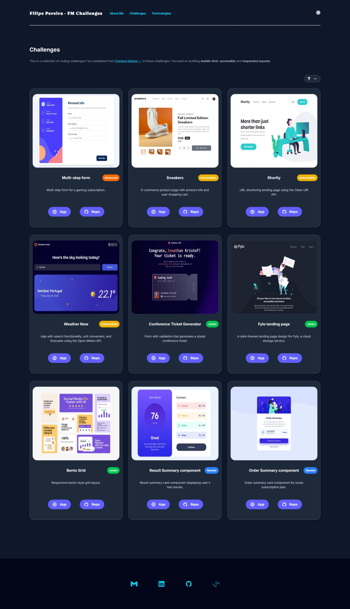
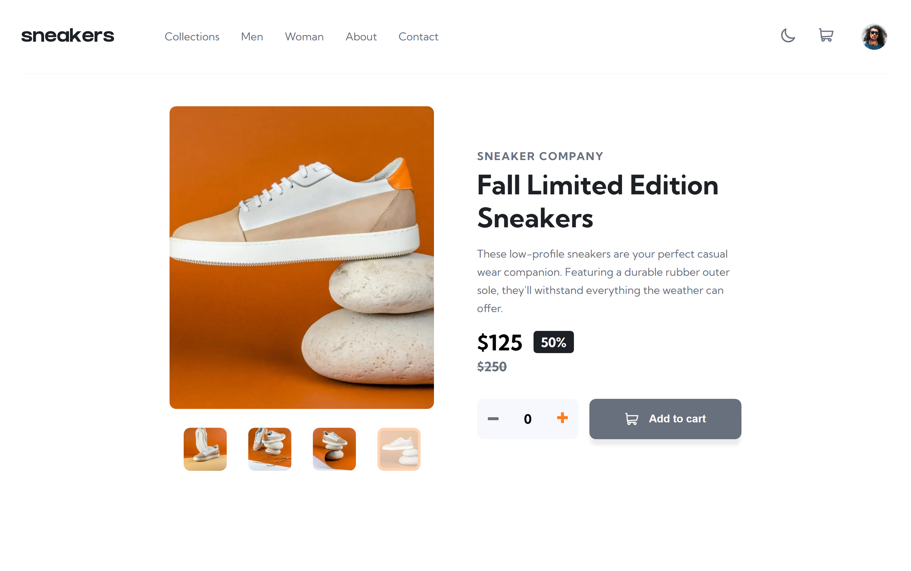
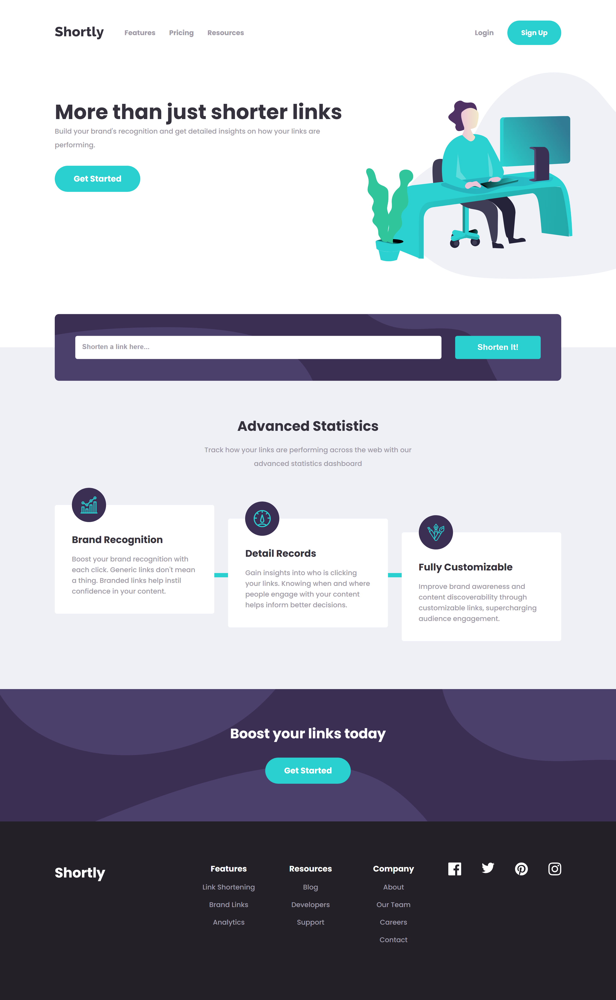
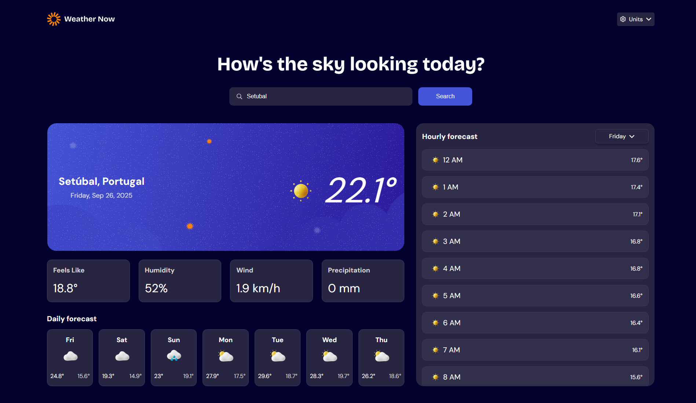
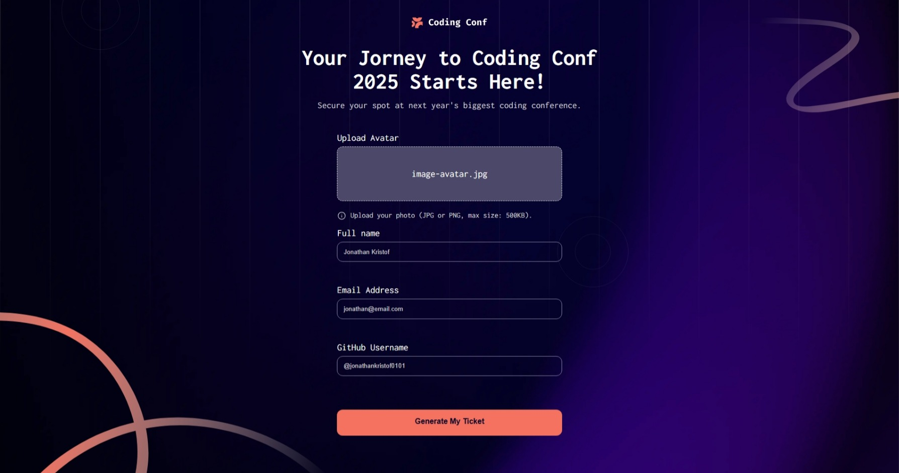
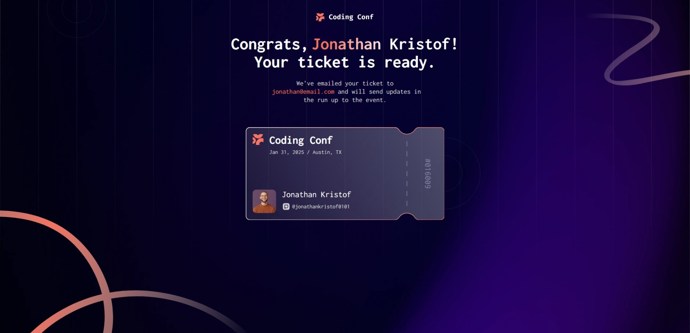
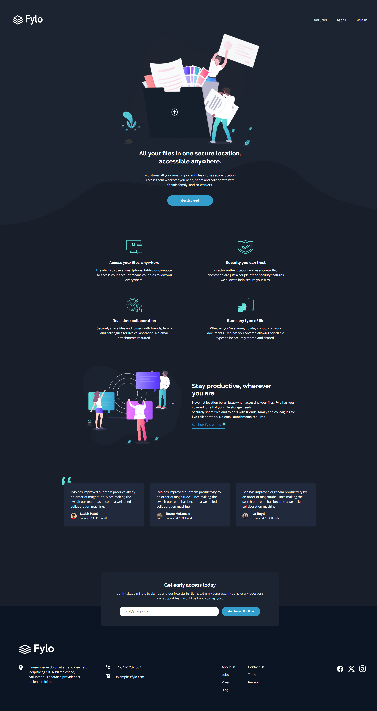
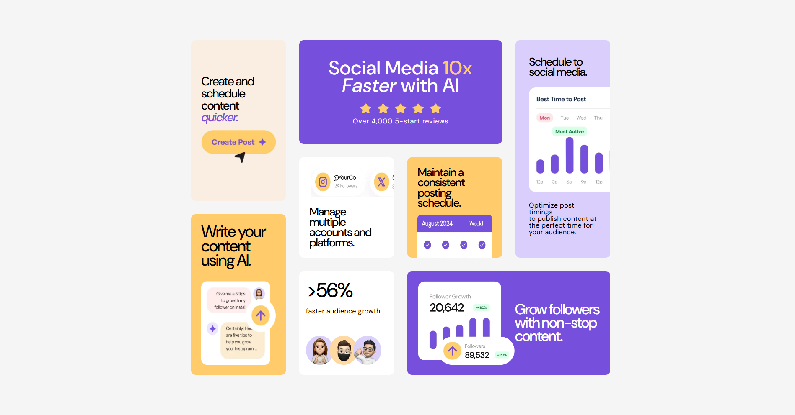
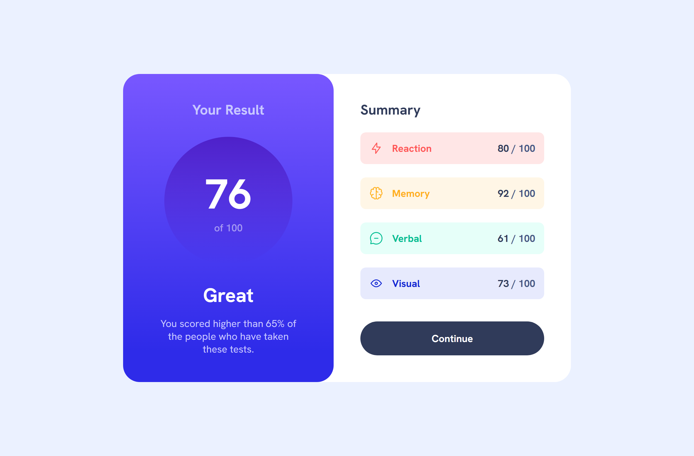

# Frontend Mentor Challenges Portfolio

This is a collection of coding challenges I’ve completed from [Frontend Mentor](https://www.frontendmentor.io/home).

🔗 [Live Demo](https://f29pereira.github.io/frontend-mentor-portfolio/)

## Table of contents

- [Overview](#overview)
- [The Challenges](#the-challenges)
  - [Intermediate Challenges](#intermediate-challenges)
    - [Sneakers](#sneakers)
    - [Shortly](#shortly)
    - [Weather Now](#weather-now)
  - [Junior Challenges](#junior-challenges)
    - [Conference Ticket Generator](#conference-ticket-generator)
    - [Fylo](#fylo)
    - [Bento Grid](#bento-grid)
  - [Newbie Challenges](#newbie-challenges)
    - [Results summary component](#result-summary-component)
    - [Order summary component](#order-summary-component)
- [Technologies](#technologies)
- [Author](#author)

## Overview

In these challenges, I focused on:

- Building **mobile-first, responsive layouts**
- Practicing **semantic HTML** and **accessible design**
- Writing **clean, maintainable React code**
- Using **TypeScript** to improve reliability

## The challenges

### Intermediate Challenges

Projects with more complex designs and functionality, with some using APIs.

#### Sneakers

A responsive e-commerce product page with product info and user shopping cart.

**Technologies used:** Next.js, React, Redux Toolkit, React and Redux Developer Tools, TypeScript, HTML, CSS, clsx, focus-trap-react, Jest, React testing library, user-event and Playwright

🔗 [Live Demo](https://f29pereira.github.io/sneakers/) | 📂 [Code](https://github.com/f29pereira/sneakers)

#### Shortly

A responsive URL shortening landing page using the [Clean URI API](https://cleanuri.com/docs).

**Technologies used:** Next.js, React, Redux Toolkit, React and Redux Developer Tools, TypeScript, HTML, CSS, Jest and React testing library

🔗 [Live Demo](https://f29pereira.github.io/shortly/) | 📂 [Code](https://github.com/f29pereira/shortly)

#### Weather Now

A responsive weather app with search functionality, unit conversion, and detailed forecasts using the [Open-Meteo API](https://open-meteo.com/).

**Technologies used:** Next.js, React, React Developer Tools, TypeScript, HTML, CSS, and Open-Meteo API

🔗 [Live Demo](https://f29pereira.github.io/weather-app/) | 📂 [Code](https://github.com/f29pereira/weather-app)

### Junior Challenges

Projects with more structured designs, form handling, and some functionality.

#### Conference Ticket Generator

A responsive web form with validation (required fields, image type and size, name, email, and GitHub username format) that generates a conference ticket upon successful submission.

**Form**

**Generated Ticket**

**Technologies used:** Next.js, React, React Developer Tools, TypeScript, HTML, CSS, Jest and React testing library

🔗 [Live Demo](https://f29pereira.github.io/conference-ticket-generator/) | 📂 [Code](https://github.com/f29pereira/conference-ticket-generator)

#### Fylo

A dark-themed landing page design for Fylo, a cloud storage service.

**Technologies used:** Next.js, React, TypeScript, HTML, and CSS

🔗 [Live Demo](https://f29pereira.github.io/fylo/) | 📂 [Code](https://github.com/f29pereira/fylo)

#### Bento Grid

Bento-style grid layout that adapts to any screen size.

**Technologies used:** Next.js, React, HTML, and CSS

🔗 [Live Demo](https://f29pereira.github.io/bento-grid/) | 📂 [Code](https://github.com/f29pereira/bento-grid)

### Newbie Challenges

Entry-level projects with simple designs that focus on HTML and CSS fundamentals.

#### Result Summary Component

A result summary card component displaying user's test results.

**Technologies used:** Next.js, React, TypeScript, HTML, CSS, Jest, React Testing Library and NVDA

🔗 [Live Demo](https://f29pereira.github.io/results-summary-component/) | 📂 [Code](https://github.com/f29pereira/results-summary-component)

#### Order Summary Component

An order summary card component for a music subscription plan.

**Technologies used:** Next.js, React, TypeScript, HTML, and CSS

🔗 [Live Demo](https://f29pereira.github.io/order-summary/) | 📂 [Code](https://github.com/f29pereira/order-summary)

## Technologies

These are the technologies I used across my Frontend Mentor challenges:

- **Frameworks:**

  [Next.js](https://nextjs.org/) - React framework for building full-stack web applications

- **Markup and Styling:**

  [HTML](https://developer.mozilla.org/en-US/docs/Web/HTML) - Markup language for documents displayed in a web browser

  [CSS](https://developer.mozilla.org/en-US/docs/Web/CSS) - Specifies the presentation/styling of a document written in a markup language

  [Tailwind CSS](https://tailwindcss.com/) - CSS framework allows to build custom designs without leaving the HTML

- **Programming Language:**

  [TypeScript](https://www.typescriptlang.org/) - Strongly typed programming language that builds on JavaScript, giving better tooling at any scale

- **Runtime:**

  [Node.js](https://nodejs.org/en) - Cross-platform JavaScript runtime environment that lets developers create servers, web apps, command line tools and scripts

- **Libraries:**

  [React](https://react.dev/) - JavaScript library for web and native UIs

  [clsx](https://www.npmjs.com/package/clsx) - Utility for constructing className strings conditionally

  [focus-trap-react](https://www.npmjs.com/package/focus-trap-react) - React component that traps focus

  [React Icons](https://react-icons.github.io/react-icons/) - Bundles popular icon sets as React components

  [Hero Icons](https://heroicons.com/) - SVG icons by the makers of Tailwind CSS

- **State Management:**

  [Redux Toolkit](https://redux-toolkit.js.org/) - Manage global app state with Redux, with less boilerplate

- **Developer Tools:**

  [React Developer Tools](https://react.dev/learn/react-developer-tools) - Extension for inspecting the React component tree and debugging props and state

  [Redux Developer Tools](https://github.com/reduxjs/redux-devtools) - Extension for tracking Redux state changes and replaying actions during debugging

  [Lighthouse](https://developer.chrome.com/docs/lighthouse) - Creates audits for performance, accessibility, progressive web apps, SEO, and more

- **Testing Frameworks and Libraries:**

  [Jest](http://jestjs.io/) - JavaScript testing framework

  [React Testing Library](https://testing-library.com/) - React components testing library

  [Playwright](https://playwright.dev/) - Automation library for E2E testing

- **Accessibility:**

  [NVDA](https://www.nvaccess.org/) - Open-source screen reader for Windows

- **Version control and CI/CD:**

  [GitHub](https://github.com/) - Version control system for tracking code changes and managing project history

  [GitHub Actions](https://github.com/features/actions) - CI/CD platform built into GitHub that automates workflows on every push or pull request

- **Design:**

  [Figma](https://www.figma.com/) - UI design and prototyping tool used to create wireframes, mockups, and design systems collaboratively

## Author

- Email - [f29.pereira@gmail.com](mailto:f29.pereira@gmail.com)
- GitHub — [@f29pereira](https://github.com/f29pereira)
- Frontend Mentor — [@f29pereira](https://www.frontendmentor.io/profile/f29pereira)
- LinkedIn — [Filipe Pereira](https://www.linkedin.com/in/filipe-pereira-b757471b9)
