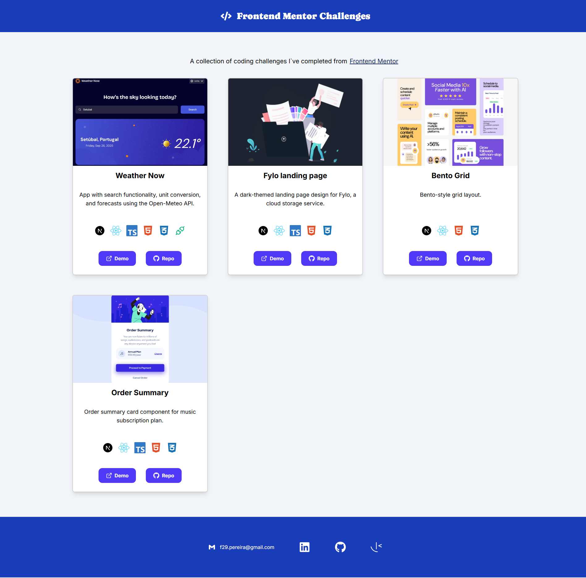

# Frontend Mentor Challenges Portfolio

This is a collection of coding challenges I’ve completed from [Frontend Mentor](https://www.frontendmentor.io/home).

🔗 [Live Demo](https://f29pereira.github.io/frontend-mentor-portfolio/)

## Table of contents

- [Overview](#overview)
- [The Challenges](#the-challenges)
- [Technologies](#technologies)
- [Author](#author)

## Overview

In these challenges, I focused on:

- Building **mobile-first, responsive layouts**
- Practicing **semantic HTML** and **accessible design**
- Writing **clean, maintainable React code**
- Using **TypeScript** to improve reliability

## The challenges

### Weather Now

A responsive weather app with search functionality, unit conversion, and detailed forecasts using the [Open-Meteo API](https://open-meteo.com/).

**Technologies used:** Next.js, React, TypeScript, HTML, CSS, and Open-Meteo API

🔗 [Live Demo](https://f29pereira.github.io/weather-app/) | 📂 [Code](https://github.com/f29pereira/weather-app)

### Fylo

A dark-themed landing page design for Fylo, a cloud storage service.

**Technologies used:** Next.js, React, TypeScript, HTML, and CSS

🔗 [Live Demo](https://f29pereira.github.io/fylo/) | 📂 [Code](https://github.com/f29pereira/fylo)

### Bento Grid

Bento-style grid layout.

**Technologies used:** Next.js, React, HTML, and CSS

🔗 [Live Demo](https://f29pereira.github.io/bento-grid/) | 📂 [Code](https://github.com/f29pereira/bento-grid)

### Order Summary

An order summary card component for a music subscription plan.

**Technologies used:** Next.js, React, TypeScript, HTML, and CSS

🔗 [Live Demo](https://f29pereira.github.io/order-summary/) | 📂 [Code](https://github.com/f29pereira/order-summary)

## Technologies

- **Frameworks:** Next.js
- **Libraries:** React
- **Languages:** TypeScript, HTML, CSS
- **APIs:** Open-Meteo API
- **Tools:** Git, GitHub, VS Code

## Author

- GitHub — [@f29pereira](https://github.com/f29pereira)
- Frontend Mentor — [@f29pereira](https://www.frontendmentor.io/profile/f29pereira)
- LinkedIn — [Filipe Pereira](https://www.linkedin.com/in/filipe-pereira-b757471b9)
